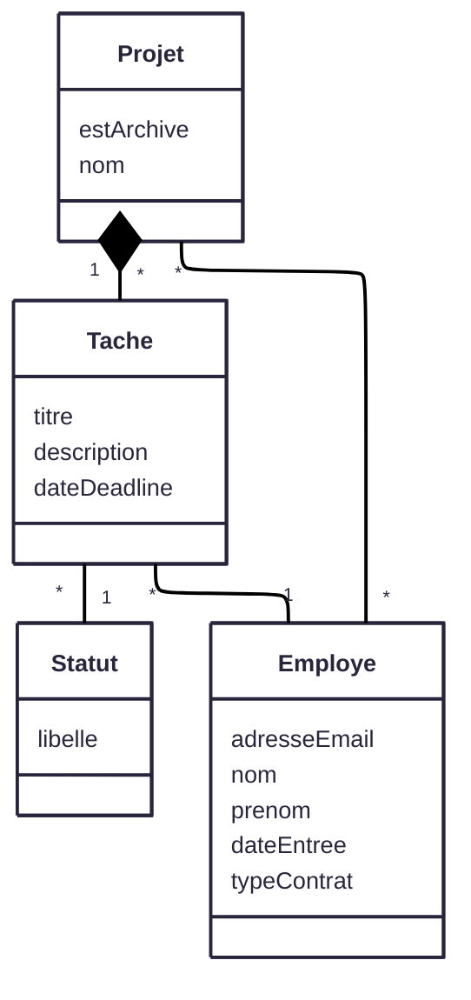

# TaskLinker

## Description

TaskLinker est un outil de gestion de projet interne pour l'entreprise BeWize.
Il s'agit d'une première version.

## Prérequis
- PHP 8.4
- Symfony 8.0.3 (il sera installé via Composer)
- autres dépendances php et symfony installées via Composer

## Installation du projet

### 1. Cloner le projet

```bash
git clone https://github.com/Vivien60/Formation_OC_Symfony_P8_mission_TaskLinker.git
cd Formation_OC_Symfony_P8_mission_TaskLinker
composer install
```
créez votre fichier environnement (.env*)

### 2. Configuration de la base de données

#### 2.1 Créer la base de données
- spécifiez le connecteur à votre base de données dans votre .env
-  Puis :
    ```bash
    php bin/console doctrine:database:create
    php bin/console doctrine:migrations:migrate
    ```

#### 2.2 Générez des données
Des fixtures ont été créées pour générer des données aléatoires
- `php bin/console doctrine:fixtures:load`

## 3. Structure du projet

### Structure du projet
Classique Symfony, à l'exception du dossier src/Core qui contient quelques classes utilitaires ou étendant Symfony.


### Diagramme de classes


### Fonctionnalités

- Ajout et gestion de projets
- Gestion des employés (pas de création)
- Ajout et gestion de taches associées à/depuis un projet

### Technologies utilisées

- **Backend** : PHP 8.4 avec Symfony 8.0.3
- **Base de données** : MySQL
- **Frontend** : HTML5, CSS3, JavaScript
- **Versionning** : Git


Ce projet est développé dans le cadre du parcours OpenClassrooms "Développeur d'application PHP/Symfony".